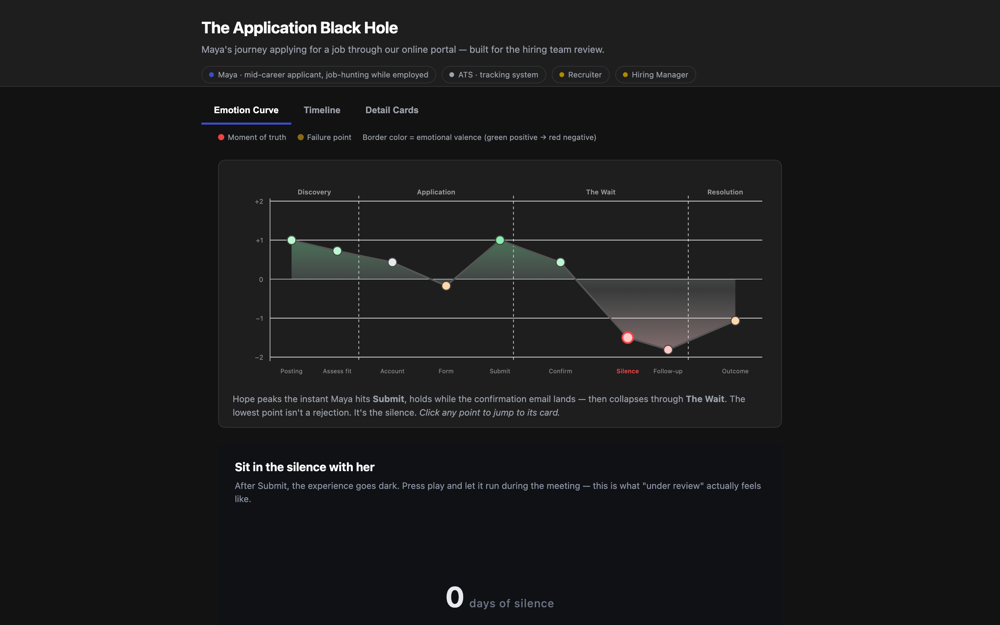
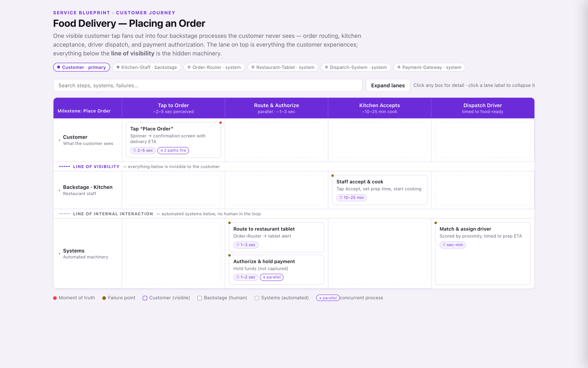
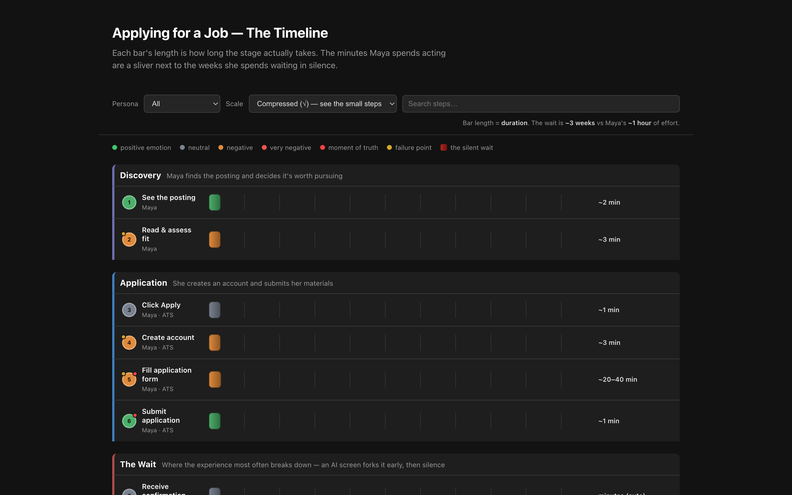

# Customer Journey Map Skill

**A living customer journey map that lives in your conversation — not in a Figma file nobody opens again.**

Most journey maps die the week they're made: a beautiful artifact, frozen, stale by
the next sprint. This skill makes the map a *living document* your AI builds, updates,
and reshapes with you across the whole life of a project — and that knows how to turn
itself into whatever the room needs. You just talk; it does the structure. You never
fill out a form — a ~100-field service-design vocabulary sits underneath, but fields
appear only when the conversation surfaces them.

---

## What it does

Four things, detected from how you talk to it — no commands to memorize:

| | | |
|---|---|---|
| **Build** | "Map how a first-time buyer sets up online payments." | A structured journey appears, milestone by milestone, from plain conversation. |
| **Update** | "We just launched instant verification — fold it in." | A *diff*, not a redraw: what changed, why, and what it ripples into. |
| **Express** | "Turn this into something for Monday's kickoff." | One map → four audiences (below). |
| **Review** | "What are we missing — and what should we map next?" | Soft-spot review + a shortlist of adjacent journeys worth mapping. |

---

## One map, four audiences

The same journey, rendered for whoever's in the room. (Full versions in [`demos/gallery/`](demos/gallery/).)

**Storyline** — makes a team *feel* the experience. For kickoffs, empathy-building.
> *Maya runs a small online store. She is not a developer… A customer fills a cart, gets
> to the payment screen, asks "Wait, you don't take card?" — and disappears.*
> *…She hits submit. And then the story stops. No progress bar. No estimate. Just a screen,
> and silence. So Maya does what anyone does in a silence that long: she assumes it's
> broken.*[^1]

**One-page brief** — for a VP with 90 seconds and a decision to make.
> **Ask:** Approve 2 sprints to add status feedback to bank verification.
> **The problem in one line:** New merchants finish signup, hit a 3-business-day wait with
> *zero feedback*, conclude the product is broken, and quit — one step before going live.
> **Cost of inaction:** the highest-impact drop-off in the funnel, at peak intent.

**Engineering handoff** — spec-shaped, for the team that has to build it.
> **Acceptance criteria**
> - [ ] After KYC submission, the owner sees a status page with current state + estimated completion date.
> - [ ] Status reflects **real** backend state, not a fake progress bar.
> - [ ] On `verification.completed`, send email/SMS with a deep link to take the first payment.

**Interactive HTML** — a self-contained, explorable map for workshops and reference.



…and the same data renders however the room needs — a brand-themed service blueprint, or
a dark timeline where a weeks-long wait dwarfs every other step:

| Swimlane (themed) | Timeline (dark) |
|---|---|
|  |  |

> Notice across all four: nobody quotes a hard drop-off percentage. The map carries no
> cited evidence, so the skill frames the abandonment as a *hypothesis* — it won't invent
> a statistic to make a slide look better. Give it real analytics and the number lands
> with its source attached. Provenance is automatic and invisible until it matters.

[^1]: Every beat traces back to a step in the journey file via footnotes — readable with or without them.

---

## See it across a project

The map isn't a one-shot artifact — it changes gear with your project, and **persists
between sessions** so it's still your expert collaborator three weeks later. One journey,
four phases ([`demos/scripts/00-hero-lifecycle.md`](demos/scripts/00-hero-lifecycle.md)
runs this end to end):

1. **Kickoff — build.** *"Map someone applying for a job through an online portal… the big
   thing is the 'application black hole.'"* → the full arc appears, fast.
2. **Evaluation — express.** *"Make an interactive HTML our hiring team can pull up."* → the
   map above, in a browser.
3. **Development — update.** *"We added an AI screen that auto-rejects in 24h, but passers
   still hit the black hole."* → a diff that folds in the fork and keeps the rest intact.
4. **Stable — review.** *"Step back — where's it weak, and what else should we map?"* → soft
   spots named (it once caught an orphaned branch in a map it had built itself) and a ranked
   list of adjacent journeys: the interview flow, the recruiter's side, the wrong-rejection appeal.

---

## Quickstart

Install so Claude Code discovers the skill:

```bash
# Personal (every project)
git clone https://github.com/cguodesign/customer-journey-map-skill ~/.claude/skills/journey
# …or per-project
git clone https://github.com/cguodesign/customer-journey-map-skill .claude/skills/journey
```

Then just start talking:

> "Help me map the journey of a small business owner setting up online payments for the first time."

It activates automatically; the map is written to `./.journey/`. **New here?** Take the
10-minute guided tour in [`demos/walkthrough.md`](demos/walkthrough.md).

> Team collaboration (one shared, synthesized map across many contributors) is on the
> roadmap. Today the skill is tuned for an individual building deep, durable customer
> understanding.

---

## Under the hood

```
SKILL.md                          # Behavior contract (the entry point)
references/
  journey.schema.md               # 13 categories, ~100 fields, provenance + composite rules
  journey.format.md               # Canonical markdown format
  html-rendering-guide.md         # Interactive HTML: rendering matrix, color, data mapping
assets/templates/                 # Rendering, interaction, and wireframe templates
examples/                         # Golden examples
demos/                            # Gallery (with screenshots), runnable scripts, guided walkthrough
```

**Foundations:** NN/g Journey Mapping, Forrester CX Index, Shostack Service
Blueprinting, Jobs-to-be-Done (Christensen), Adaptive Path Experience Maps, the Double
Diamond.

## License

MIT
